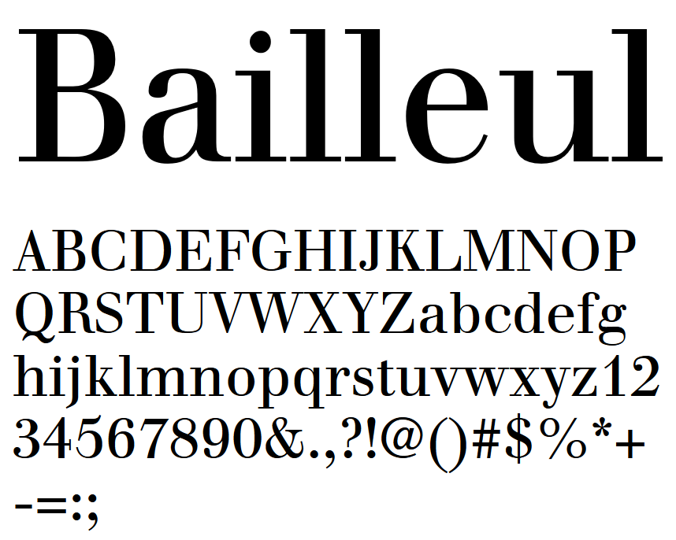
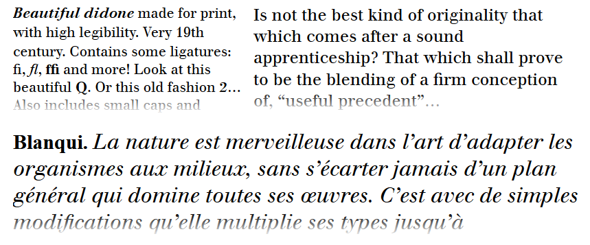

# Bailleul Roman

**yomli**  
*SIL Open Font License, 1.1*

I present to you a new font: Bailleul, a didone inspired by the Cicéro Bailleul typeface and based on Justus Roman. Bailleul et cie was a Parisian foundry mainly active during the 19th century. Its work can be found in [Spécimen des caractères de la fonderie Bailleul et cie, rue des Boucheries St.-G. 38. Premier cahier](https://books.google.fr/books?id=Tg8_AAAAcAAJ) and [L'Éternité par les astres](http://gallica.bnf.fr/ark:/12148/bpt6k86534r) by Auguste Blanqui in 1872. 

#### Styles
* Roman
* Italic
* Bold
* Bold Italic

Cicéro Bailleul is much more condensed (yet legible), but I plan to make a condensed version of Bailleul Roman. 

### License

Copyright © 2019, yomli.

Licensed under the [*SIL Open Font License, 1.1*](http://scripts.sil.org/OFL); you may not use this file except in compliance with the License.